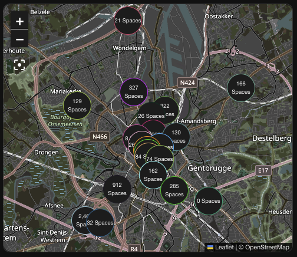

# Show entities on a map
The integration returns a list of sensors, which can be plotted out on a map:


When using the [`custom:map-card`](https://github.com/nathan-gs/ha-map-card) integration, it is possible to add tap actions to the plotted sensors, which then can trigger a navigation event.

Example map-card configuration, with only one sensor for readability:
```yaml
type: custom:map-card
card_size: 8
entities:
  - entity: sensor.savaanstraat
    display: state
    tap_action:
      action: call-service
      service: script.navigate_to_location
      data:
        entity_id: sensor.savaanstraat
```

This calls a service [`script.navigate_to_location`](navigate_to_parking.md) which then triggers a Waze url that makes Waze start navigating towards the selected parking.